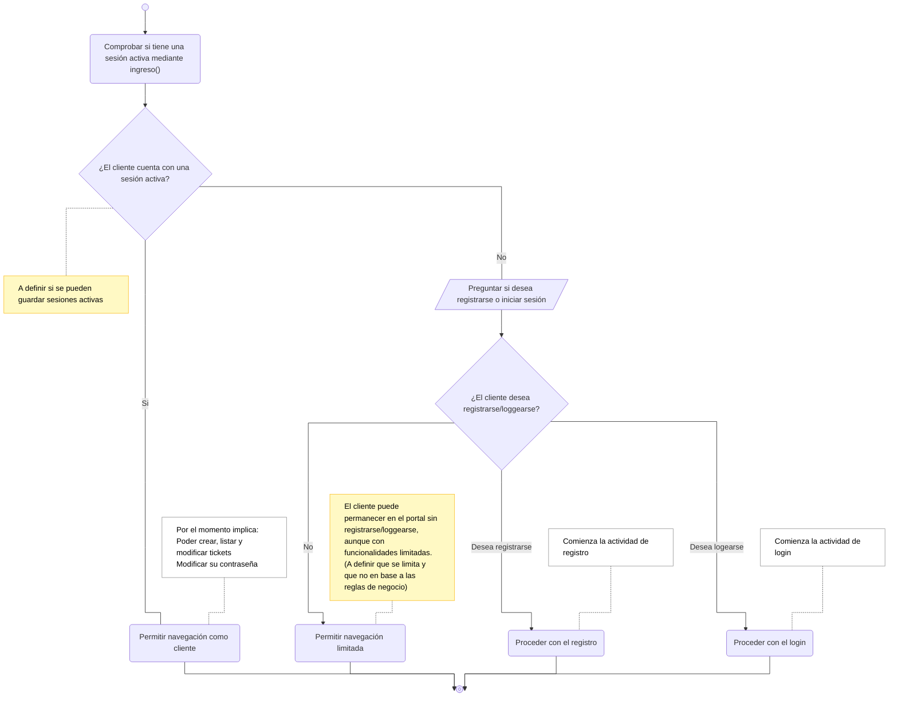
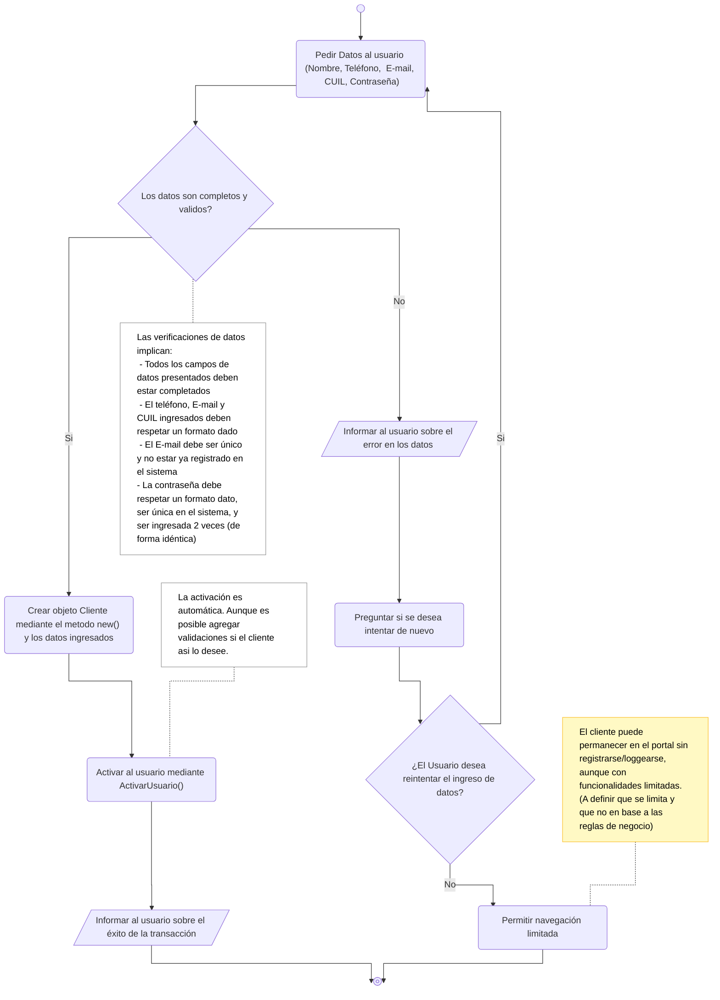
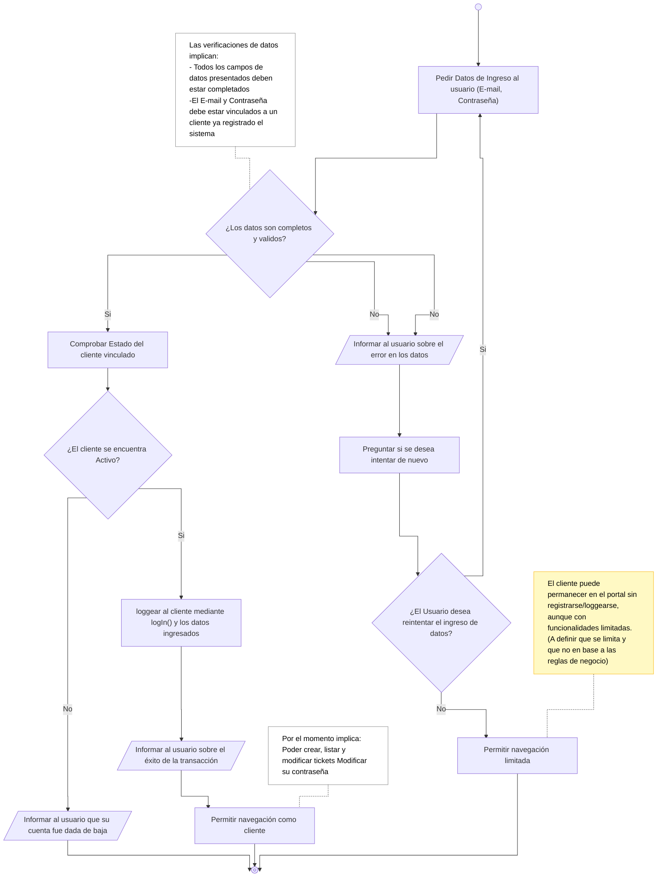
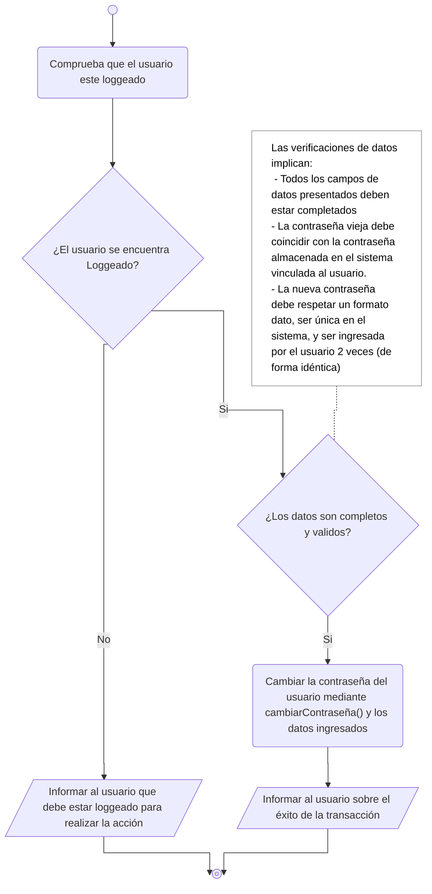
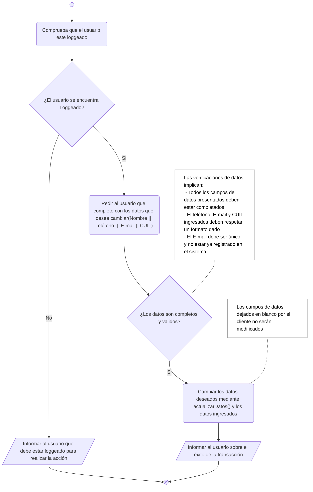
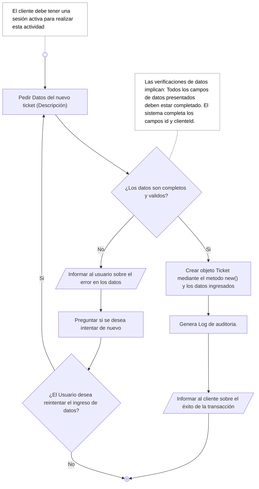
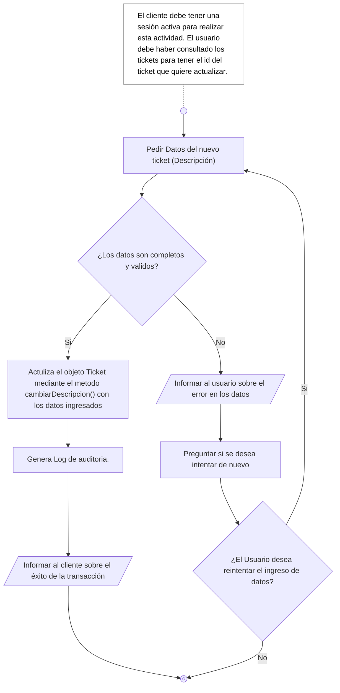
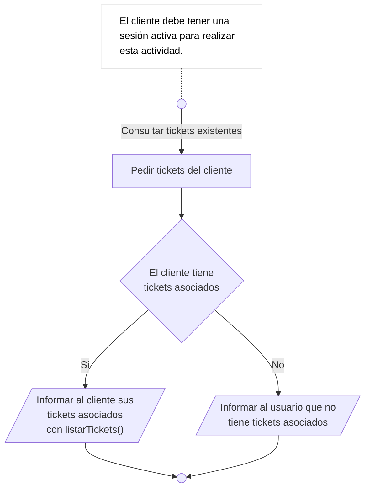
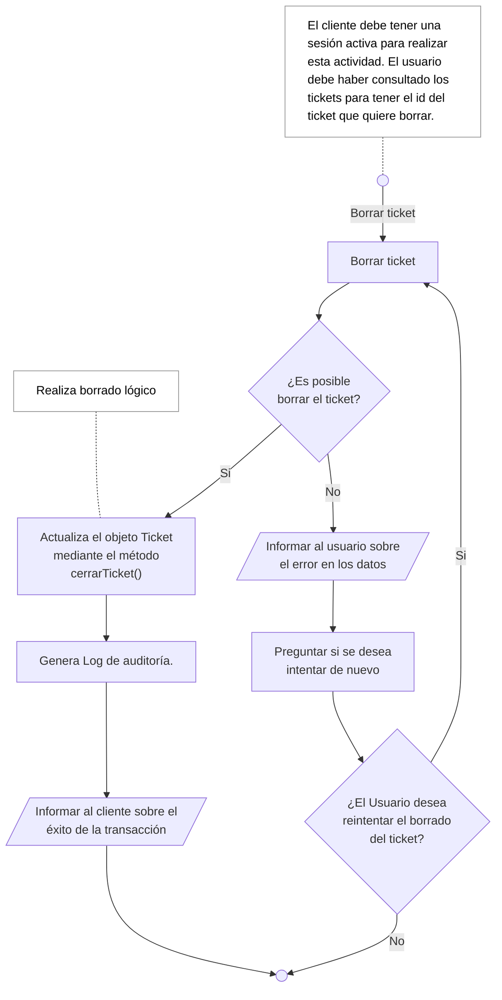

### ACT-01

```mermaid 
flowchart TD
    %%{ init: { 'flowchart': { 'curve': 'stepAfter' } } }%%
    Start@{ shape: sm-circ, label: "Small start" }
    
    id1("Comprobar si tiene una sesión activa mediante ingreso()")
    id2{¿El cliente cuenta con una sesión activa?}
    N1["A definir si se pueden guardar sesiones activas"]
    style N1 fill:#fff9c4,stroke:#fbc02d,stroke-width:1px,text-align:left, color:black
    id3(Permitir navegación como cliente)
    N2["Por el momento implica: <br>Poder crear, listar y modificar tickets <br>Modificar su contraseña"]
    style N2 fill:#ffffff,stroke:#969696,stroke-width:1px,text-align:left, color:black
    id4@{ shape: lean-r, label: "Preguntar si desea registrarse o iniciar sesión" }
    id5{¿El cliente desea registrarse/loggearse?}
    id6(Permitir navegación limitada)
    N3["El cliente puede permanecer en el portal sin registrarse/loggearse, aunque con funcionalidades limitadas. (A definir que se limita y que no en base a las reglas de negocio)"]
    style N3 fill:#fff9c4,stroke:#fbc02d,stroke-width:1px,text-align:left, color:black
    id7(Proceder con el registro)
    N4["Comienza la actividad de registro"]
    style N4 fill:#ffffff,stroke:#969696,stroke-width:1px,text-align:left, color:black
    id8(Proceder con el login)
    N5["Comienza la actividad de login"]
    style N5 fill:#ffffff,stroke:#969696,stroke-width:1px,text-align:left, color:black

    Stop@{ shape: fr-circ, label: "Stop" }
    

    Start --> id1
    id1 --> id2
    id2 -- Si --- id3
    id2 -- No --- id4
    id4 --> id5
    id5 -- No ---> id6
    id5 -- Desea registrarse ---> id7
    id5 -- Desea logearse ---> id8
    id3 --> Stop
    id6 --> Stop
    id7 --> Stop
    id8 --> Stop

    id2 -.- N1
    N2 -.- id3
    N3 -.- id6
    N4 -.- id7
    N5 -.- id8
```
---
### ACT-02

```mermaid 
flowchart TD
    %%{ init: { 'flowchart': { 'curve': 'stepAfter' } } }%%

        Start@{ shape: sm-circ, label: "Small start" } --> A("Pedir Datos al usuario (Nombre, Teléfono,  E-mail,  CUIL, Contraseña)") 
        A --> B{Los datos son completos y validos?}
        B -->|No| C@{ shape: lean-r, label: "Informar al usuario sobre el error en los datos " }
        B -->|Si| D("Crear objeto Cliente mediante el metodo new() y los datos ingresados")
        D --> E("Activar al usuario mediante ActivarUsuario()")
        E --> F@{ shape: lean-r, label: "Informar al usuario sobre el éxito de la transacción" }
        F--> G@{ shape: fr-circ, label: "Stop" }
        C --> H("Preguntar si se desea intentar de nuevo")
        H --> I{"¿El Usuario desea reintentar el ingreso de datos?"}
        I -->|Si| A
        I -->|No| J("Permitir navegación limitada")
        J --> G

        %% Notas
        K["El cliente puede permanecer en el portal sin registrarse/loggearse, aunque con funcionalidades limitadas. (A definir que se limita y que no en base a las reglas de negocio)"] -.- J

        B -.- L["Las verificaciones de datos implican:<br> - Todos los campos de datos presentados deben estar completados<br> - El teléfono, E-mail y CUIL ingresados deben respetar un formato dado<br> - El E-mail debe ser único y no estar ya registrado en el sistema <br>- La contraseña debe respetar un formato dato, ser única en el sistema, y ser ingresada 2 veces (de forma idéntica)"]

        M["La activación es automática. Aunque es posible agregar validaciones si el cliente asi lo desee."] -.- E

        style L fill:#ffffff,stroke:#969696,stroke-width:1px,text-align:left, color:black
        style M fill:#ffffff,stroke:#969696,stroke-width:1px,text-align:left, color:black
        style K fill:#fff9c4,stroke:#fbc02d,stroke-width:1px,text-align:left, color:black
```
---
### ACT-03

```mermaid 
flowchart TD
    %%{ init: { 'flowchart': { 'curve': 'stepAfter' }}}%%

    A@{ shape: sm-circ, label: "Small start" }
    
    B@{ shape: rect, label: "Pedir Datos de Ingreso al usuario (E-mail,  Contraseña)"}

    rombo1{"¿Los datos son completos y validos?"}
    
    C@{ shape: rect, label: "Comprobar Estado del cliente vinculado" }
    
    rombo2{"¿El cliente se encuentra Activo?"}
    
    D@{ shape: rect, label: "loggear al cliente mediante logIn() y los datos ingresados" }

    E@{ shape: lean-r, label: "Informar al usuario sobre el éxito de la transacción" }

    F@{ shape: rect, label: "Permitir navegación como cliente" }

    H@{ shape: lean-r, label: "Informar al usuario que su cuenta fue dada de baja" }
    
    I@{ shape: lean-r, label: "Informar al usuario sobre el error en los datos" }
    
    J@{ shape: rect, label: "Preguntar si se desea intentar de nuevo" }
    
    rombo3{"¿El Usuario desea reintentar el ingreso de datos?" }

    K@{ shape: framed-circle, label: "Stop" }

    L@{ shape: rect, label: "Permitir navegación limitada"}

    Z["Las verificaciones de datos implican: <br>- Todos los campos de datos presentados deben estar completados <Br>-El E-mail y Contraseña debe estar vinculados a un cliente ya registrado el sistema" ]

    X["Por el momento implica: Poder crear, listar y modificar tickets Modificar su contraseña" ]

    Y["El cliente puede permanecer en el portal sin registrarse/loggearse, aunque con funcionalidades limitadas. (A definir que se limita y que no en base a las reglas de negocio)" ]
    style Z fill:#ffffff,stroke:#969696,stroke-width:1px,text-align:left, color:black
    style X fill:#ffffff,stroke:#969696,stroke-width:1px,text-align:left, color:black
    style Y fill:#fff9c4,stroke:#fbc02d,stroke-width:1px,text-align:left, color:black


    Z-.-rombo1

    A --> B
    B --> rombo1

    rombo1 --> |Si|C
    C-->rombo2
    rombo2-->|Si|D
    rombo2-->|No|H
    H --> K

    D --> E
    E --> F
    F --> K

    rombo1 -->|No|I

    rombo1 -->|No|I
    I --> J
    J --> rombo3
    rombo3 -->|Si|B
    rombo3 -->|No|L
    L --> K

    X-.-F
    Y-.-L
```
---
### ACT-04

```mermaid 
flowchart TD
    %%{ init: { 'flowchart': { 'curve': 'stepAfter' } } }%%
    Start@{ shape: sm-circ, label: "Small start" }--> A("Comprueba que el usuario este loggeado") 
    Stop@{ shape: fr-circ, label: "Stop" }

    A --> B{¿El usuario se encuentra Loggeado?}
    B -->|No | C@{ shape: lean-r, label: "Informar al usuario que debe estar loggeado para realizar la acción"}
    C --> Stop
    B --> |Si| D{¿Los datos son completos y validos?}
    D -->|Si| E("Cambiar la contraseña del usuario mediante cambiarContraseña() y los datos ingresados")
    E --> F@{ shape: lean-r, label: "Informar al usuario sobre el éxito de la transacción"}
    F --> Stop

    N1["Las verificaciones de datos implican: <br> - Todos los campos de datos presentados deben estar completados <br>- La contraseña vieja debe coincidir con la contraseña almacenada en el sistema vinculada al usuario.<br>- La nueva contraseña debe respetar un formato dato, ser única en el sistema, y ser ingresada por el usuario 2 veces (de forma idéntica)" ]
    style N1 fill:#ffffff,stroke:#969696,stroke-width:1px,text-align:left, color:black
    N1 -.- D
```
---
### ACT-05

```mermaid 
flowchart TD
    Start@{ shape: sm-circ, label: "Small start"}--> A("Comprueba que el usuario este loggeado") 
    Stop@{ shape: fr-circ, label: "Stop" }

    A --> B{¿El usuario se encuentra Loggeado?}
    B -->|No | C@{ shape: lean-r, label: "Informar al usuario que debe estar loggeado para realizar la acción"}
    C --> Stop
    B --> |Si| D("Pedir al usuario que complete con los datos que desee cambiar(Nombre || Teléfono ||  E-mail || CUIL)")
    D --> E{¿Los datos son completos y validos?}
    E -->|Si| F("Cambiar los datos deseados mediante actualizarDatos() y los datos ingresados")
    F --> G@{ shape: lean-r, label: "Informar al usuario sobre el éxito de la transacción"}
    G --> Stop

    N1["Las verificaciones de datos implican: <br> - Todos los campos de datos presentados deben estar completados <br>- El teléfono, E-mail y CUIL ingresados deben respetar un formato dado <br>- El E-mail debe ser único y no estar ya registrado en el sistema" ]
    N1 -.- E
    N2["Los campos de datos dejados en blanco por el cliente no serán modificados" ]
    N2 -.- F
    style N2 fill:#ffffff,stroke:#969696,stroke-width:1px,text-align:left, color:black
    style N1 fill:#ffffff,stroke:#969696,stroke-width:1px,text-align:left, color:black

```
---
### ACT-06

```mermaid 
flowchart TD

    A@{ shape: sm-circ, label: "Small start" }

    B@{ shape: rect, label: "Pedir Datos del nuevo ticket (Descripción)" }

    rombo1{"¿Los datos son completos y validos?"}

    C@{ shape: rect, label: "Crear objeto Ticket mediante el metodo new() y los datos ingresados" }

    D@{ shape: lean-r, label: "Informar al usuario sobre el error en los datos" }

    rombo2{¿El Usuario desea reintentar el ingreso de datos?}

    E["Las verificaciones de datos implican: Todos los campos de datos presentados deben estar completado. El sistema completa los campos id y clienteId." ]
    
    F@{ shape: rect, label: "Genera Log de auditoria." }

    G@{ shape: lean-r, label: "Informar al cliente sobre el éxito de la transacción" }

    H@{ shape: framed-circle, label: "Stop" }

    I@{ shape: rect, label: "Preguntar si se desea intentar de nuevo" }

    J[El cliente debe tener una sesión activa para realizar esta actividad]
    style J fill:#ffffff,stroke:#969696,stroke-width:1px,text-align:left, color:black
    style E fill:#ffffff,stroke:#969696,stroke-width:1px,text-align:left, color:black

    J-.-A

    A-->B
    B-->rombo1
    E -.- rombo1

    rombo1-->|Si|C
    C-->F
    F-->G
    G-->H

    rombo1-->|No|D
    D-->I
    I-->rombo2

    rombo2-->|Si|B
    rombo2-->|No|H      
```
---
### ACT-07

```mermaid 
flowchart TD
    A@{ shape: sm-circ, label: "Small start" }

    B@{ shape: rect, label: "Pedir Datos del nuevo ticket (Descripción)" }

    rombo1{"¿Los datos son completos y validos?"}

    C@{ shape: rect, label: "Actuliza el objeto Ticket mediante el metodo cambiarDescripcion() con los datos ingresados" }

    D@{ shape: lean-r, label: "Informar al usuario sobre el error en los datos" }

    rombo2{¿El Usuario desea reintentar el ingreso de datos?}

    E["El cliente debe tener una sesión activa para realizar esta actividad. El usuario debe haber consultado los tickets para tener el id del ticket que quiere actualizar." ]
    
    F@{ shape: rect, label: "Genera Log de auditoria." }

    G@{ shape: lean-r, label: "Informar al cliente sobre el éxito de la transacción" }

    H@{ shape: framed-circle, label: "Stop" }

    I@{ shape: rect, label: "Preguntar si se desea intentar de nuevo" }
    style E fill:#ffffff,stroke:#969696,stroke-width:1px,text-align:left, color:black

    E-.-A

    A-->B
    B-->rombo1

    rombo1-->|Si|C
    C-->F
    F-->G
    G-->H

    rombo1-->|No|D
    D-->I
    I-->rombo2

    rombo2-->|Si|B
    rombo2-->|No|H      
```
---

### ACT-08

```mermaid 
flowchart TD
  
    Z["El cliente debe tener una sesión activa para realizar esta actividad."]
    style Z fill:#ffffff,stroke:#969696,stroke-width:1px,text-align:left, color:black
    
    A(( )) -->|Consultar tickets existentes| B["Pedir tickets del cliente"]
    
    B --> C{"El cliente tiene<br/>tickets asociados"}
   
    C -->|Si| D[/"Informar al cliente sus<br/>tickets asociados<br/>con listarTickets()"/]
    C -->|No| E[/"Informar al usuario que no<br/>tiene tickets asociados"/]
    
    D --> F(( ))
    E --> F

    Z -.- A
```
---
### ACT-09

```mermaid 
flowchart TD

    Z["El cliente debe tener una sesión activa para realizar esta actividad. El usuario debe haber consultado los tickets para tener el id del ticket que quiere borrar."]

    Z-.-A

    A(( )) -->|Borrar ticket| B["Borrar ticket"]
    
    B --> C{"¿Es posible<br/>borrar el ticket?"}
    X-.-D
    
    C -->|Si| D["Actualiza el objeto Ticket<br/>mediante el método<br/>cerrarTicket()"]

    X["Realiza borrado lógico"]

    
    D --> E["Genera Log de auditoría."]
    E --> F[/"Informar al cliente sobre el<br/>éxito de la transacción"/]
    F --> G(( ))

    C -->|No| H[/"Informar al usuario sobre<br/>el error en los datos"/]
    H --> I["Preguntar si se desea<br/>intentar de nuevo"]
    I --> J{"¿El Usuario desea<br/>reintentar el borrado<br/>del ticket?"}
    
    J -->|Si| B
    J -->|No| G

    style Z fill:#ffffff,stroke:#969696,stroke-width:1px,text-align:left, color:black
    style X fill:#ffffff,stroke:#969696,stroke-width:1px,text-align:left, color:black

```

