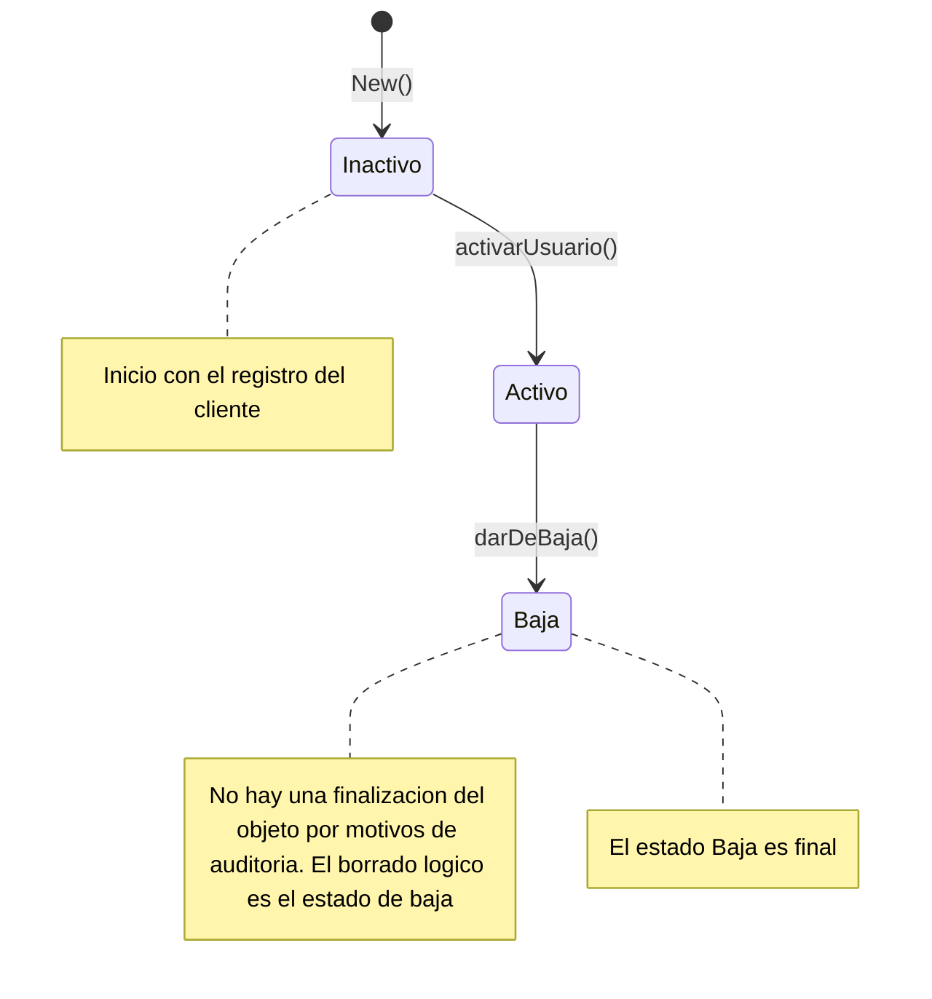
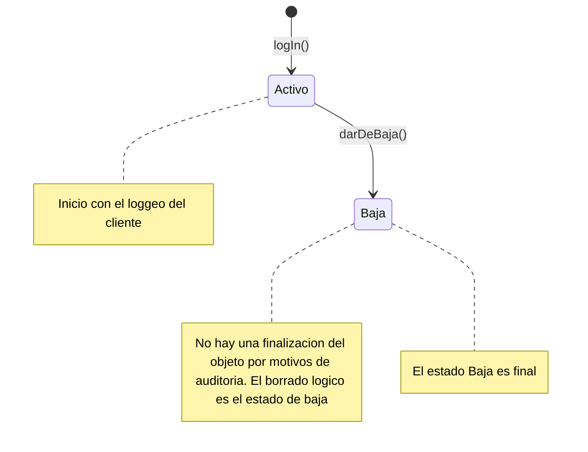
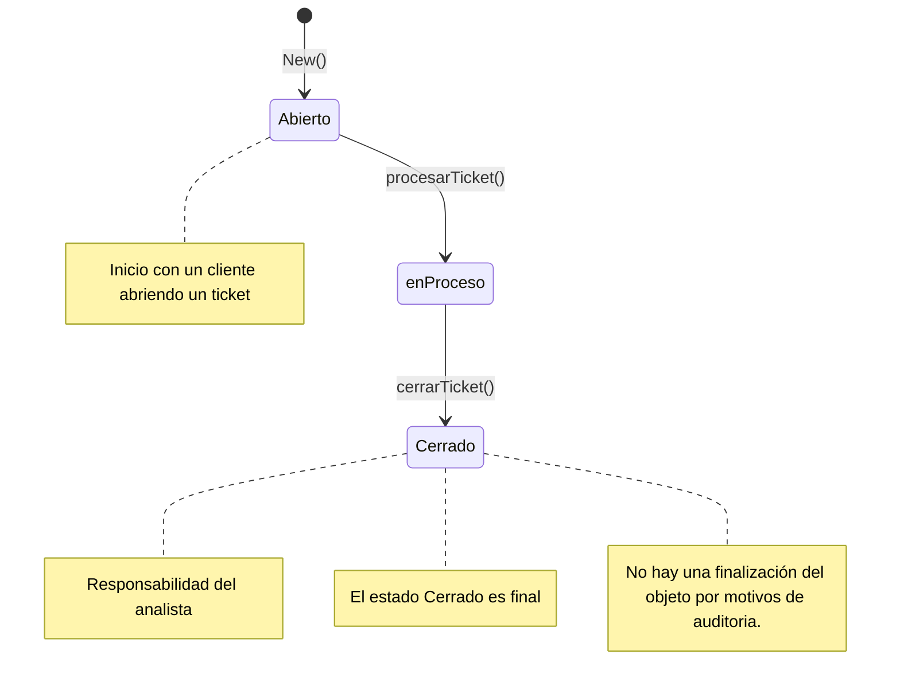

## Diagramas de Estados

### Diagrama de estados Cliente (Cuando el inicio es por registro)

```mermaid
stateDiagram-v2

    [*] --> Inactivo : New()
    Inactivo --> Activo : activarUsuario()
    Activo --> Baja : darDeBaja()

    note right of Inactivo
            Inicio con el registro del cliente
    end note

    note right of Baja
        No hay una finalizacion del objeto por motivos de auditoria. El borrado logico es el estado de baja
    end note

    note right of Baja
        El estado Baja es final
    end note

```

### Diagrama de estados Cliente (Cuando el inicio es por loggeo)

```mermaid
stateDiagram-v2

    [*] --> Activo : logIn()
    Activo --> Baja : darDeBaja()

    note right of Activo
            Inicio con el loggeo del cliente
    end note

    note right of Baja
        No hay una finalizacion del objeto por motivos de auditoria. El borrado logico es el estado de baja
    end note

    note right of Baja
        El estado Baja es final
    end note

```

### Diagrama de estados Ticket

```mermaid
stateDiagram-v2

    [*] --> Abierto : New()
    Abierto --> enProceso : procesarTicket()
    enProceso --> Cerrado : cerrarTicket() 

    note right of Abierto
            Inicio con un cliente abriendo un ticket
    end note

    note right of Cerrado
        Responsabilidad del analista
    end note

    note right of Cerrado
        El estado Cerrado es final
    end note 
    
    note right of Cerrado
        No hay una finalización del objeto por motivos de auditoria.
    end note 


```