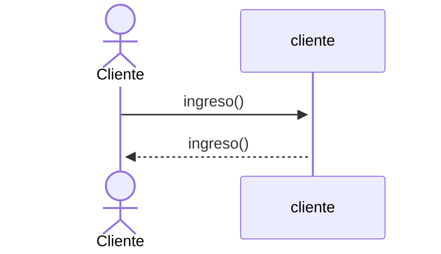
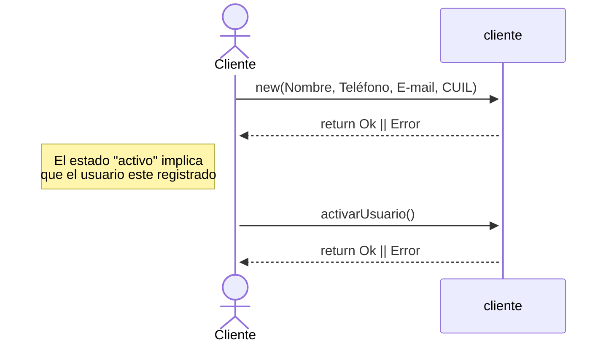
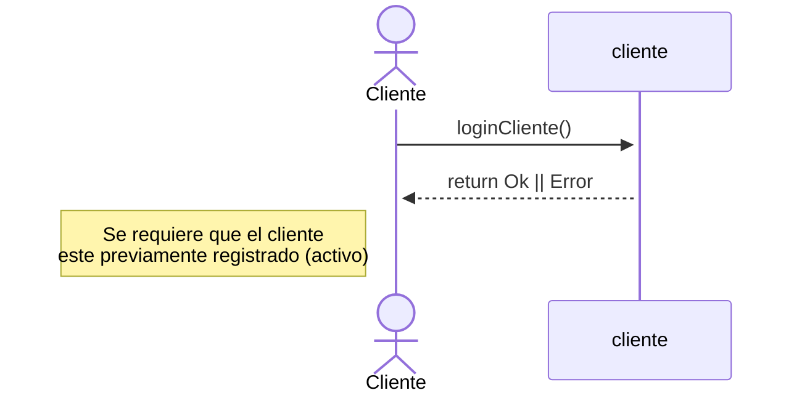
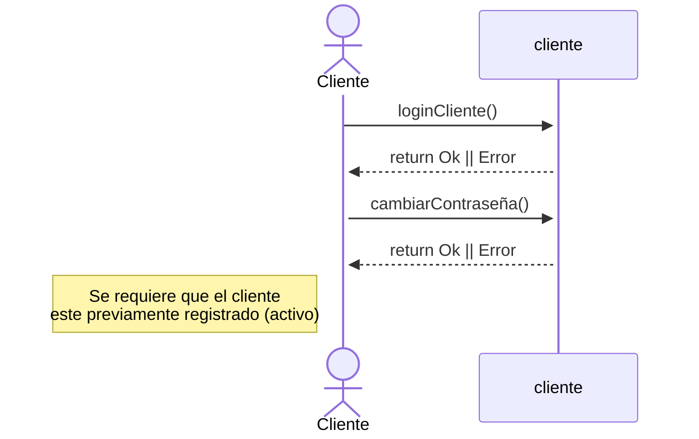
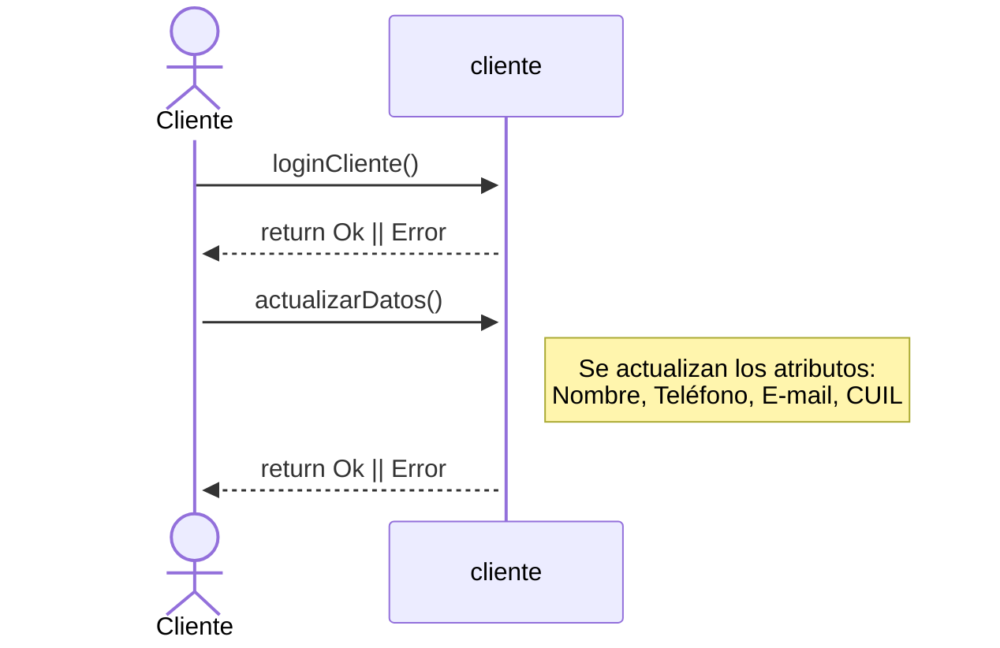
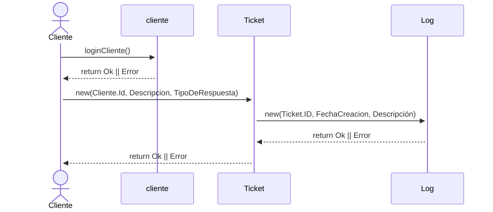
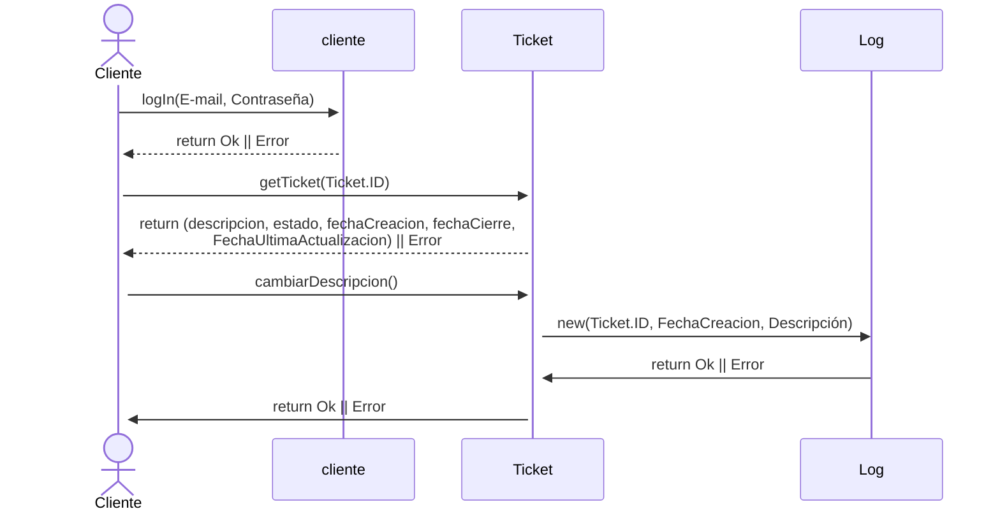
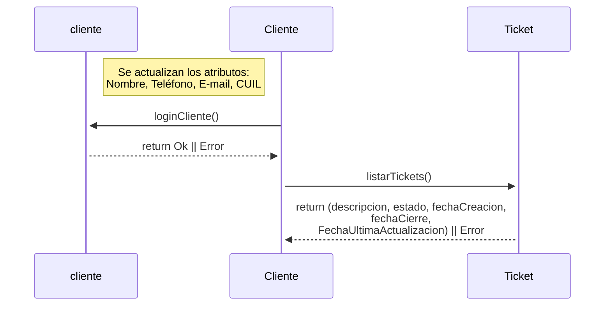
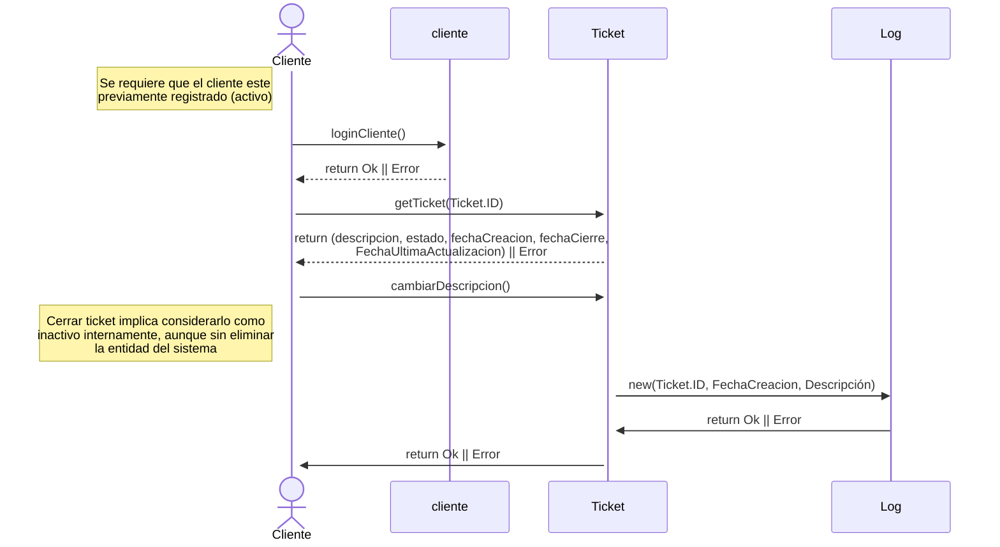

### A. Ingreso de un nuevo cliente (SEC-01)

-----------------------

### B. Registro de un cliente (SEC-02)

-----------------------

### C. Acceso de un cliente (SEC-03)

-----------------------
### D. Cambio de Password (SEC-04)

-----------------------

### E. Actualizacion de datos de un cliente (SEC-05)

-----------------------

### F. Abrir nuevo ticket (SEC-06)

-----------------------

### G. Actualizar ticket (SEC-07)

-----------------------
### H. Consultar tickets existentes (SEC-08)

-----------------------

### I. Borrar ticket (SEC-09)

-----------------------
