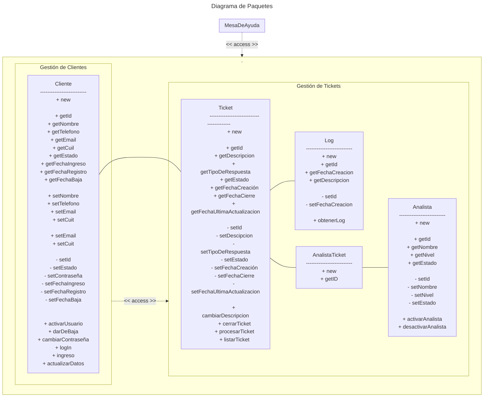

```mermaid
---
title: Diagrama de Paquetes
---
flowchart TB
    subgraph MesaDeAyuda
    end

    subgraph CLienteTicket [.]
        subgraph GestionClientes [Gestión de Clientes]
            Cliente[Cliente
            --------------------------         
            + new

            + getId 
            + getNombre 
            + getTelefono 
            + getEmail
            + getCuil
            + getEstado
            + getFechaIngreso
            + getFechaRegistro
            + getFechaBaja
            
            + setNombre
            + setTelefono
            + setEmail
            + setCuit

            + setEmail
            + setCuit

            - setId
            - setEstado
            - setContraseña
            - setFechaIngreso
            - setFechaRegistro
            - setFechaBaja


            + activarUsuario
            + darDeBaja
            + cambiarContraseña
            + logIn
            + ingreso
            + actualizarDatos]
  
        end

        subgraph GestionTickets [Gestión de Tickets]
            Ticket[Ticket
            -----------------------------------------         
            + new

            + getId
            + getDescripcion
            + getTipoDeRespuesta
            + getEstado
            + getFechaCreación
            + getFechaCierre
            + getFechaUltimaActualizacion

            - setId
            - setDescipcion
            - setTipoDeRespuesta
            - setEstado
            - setFechaCreación
            - setFechaCierre
            - setFechaUltimaActualizacion

            + cambiarDescripcion
            + cerrarTicket
            + procesarTicket
            + listarTicket]

            AnalistaTicket[AnalistaTicket
            --------------------------         
            + new
            + getID]

            Analista[Analista
            --------------------------         
            + new

            + getId
            + getNombre
            + getNivel
            + getEstado

            - setId
            - setNombre
            - setNivel
            - setEstado

            + activarAnalista
            + desactivarAnalista
            ]
            Log[Log
            --------------------------         
            + new
            + getId
            + getFechaCreacion
            + getDescripcion

            - setId
            - setFechaCreacion

            + obtenerLog]
        end

        Cliente --- Ticket
        Ticket --- Log
        Ticket --- AnalistaTicket
        AnalistaTicket --- Analista

        GestionClientes -.->|<< access >>| GestionTickets
    end 
        MesaDeAyuda -.->|<< access >>| CLienteTicket
```