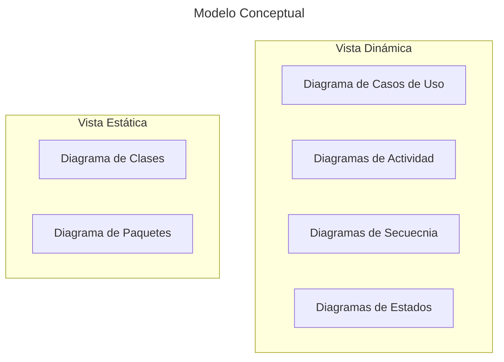

```mermaid
---
title: Modelo Conceptual
---
flowchart TB

    subgraph VistaDinamica [Vista Dinámica]
         Diagrama_de_Casos_de_Uso[Diagrama de Casos de Uso]
        Diagramas_de_Actividad[Diagramas de Actividad]
        Diagramas_de_Secuencia[Diagramas de Secuecnia]
        Diagramas_de_Estados[Diagramas de Estados]
    end
    subgraph VistaEstatica [Vista Estática]
        Diagrama_de_Clases[Diagrama de Clases]
        Diagrama_de_Paquetes[Diagrama de Paquetes]
    end


```