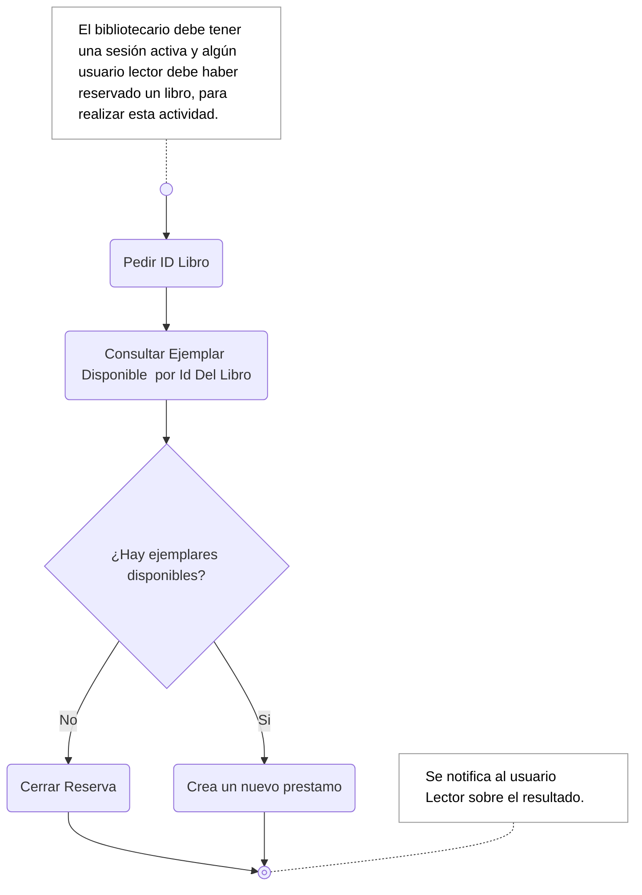

```mermaid 
flowchart TD
    A@{ shape: sm-circ, label: "Small start" }
    
    B@{ shape: rounded, label: "Pedir ID Libro" }

    C@{ shape: rounded, label: "Consultar Ejemplar Disponible  por Id Del Libro" }

    rombo1{"¿Hay ejemplares disponibles?"}

    D@{ shape: rounded, label: "Cerrar Reserva" }

    I@{ shape: rounded, label: "Crea un nuevo prestamo" }

    E["El bibliotecario debe tener una sesión activa y algún usuario lector debe haber reservado un libro, para realizar esta actividad." ]

    F["Se notifica al usuario Lector sobre el resultado." ]
    
    H@{ shape: framed-circle, label: "Stop" }

    style E fill:#ffffff,stroke:#969696,stroke-width:1px,text-align:left, color:black

    style F fill:#ffffff,stroke:#969696,stroke-width:1px,text-align:left, color:black

    E -.- A
    A --> B
    B --> C
    C --> rombo1

    rombo1 -->|No| D
    rombo1 -->|Si| I

    D --> H
    I --> H

    F -.- H
```