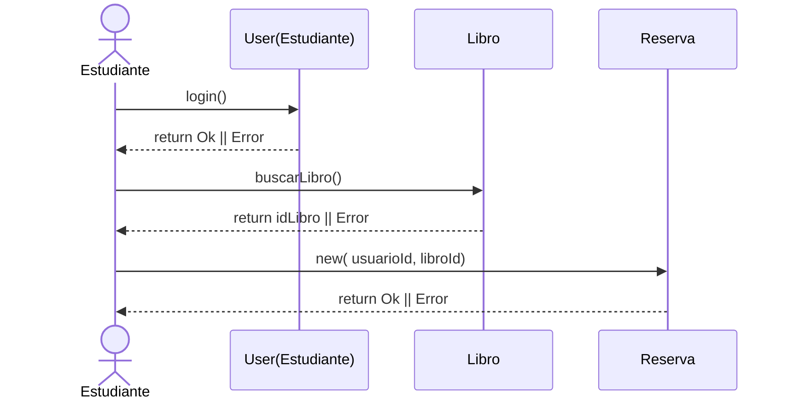
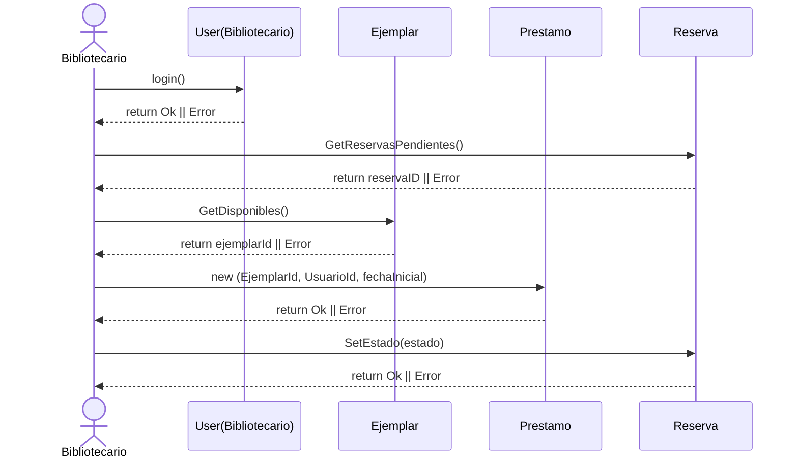
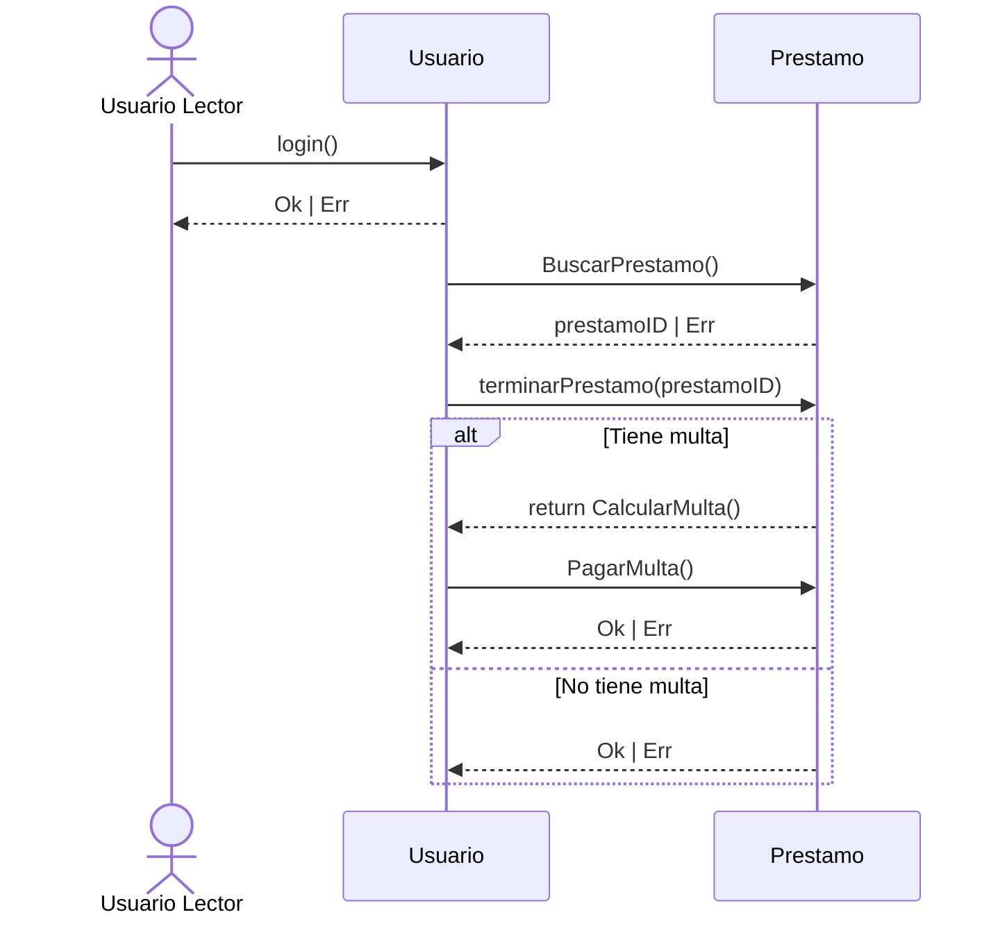

### Diagrama de Secuencia (Generar Reserva de un Libro)

---
### Diagrama de Secuencia (Cerrar Reserva y Registrar préstamo de un libro)

---
### Diagrama de Secuencia (Terminar prestamo y Pago de multa)
