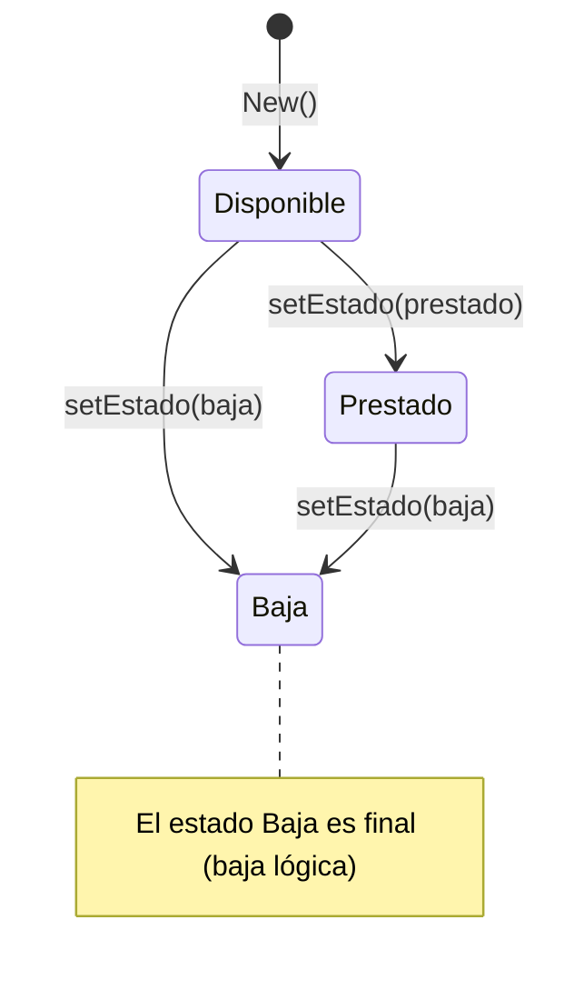

### Diagrama de Estados (Sistema de Gestión de Biblioteca)

```mermaid

stateDiagram-v2

    [*] --> Disponible : New()
    Disponible --> Prestado : setEstado(prestado)
    Disponible --> Baja : setEstado(baja)
    Prestado --> Baja : setEstado(baja)

    note right of Baja
        El estado Baja es final (baja lógica)
    end note
```