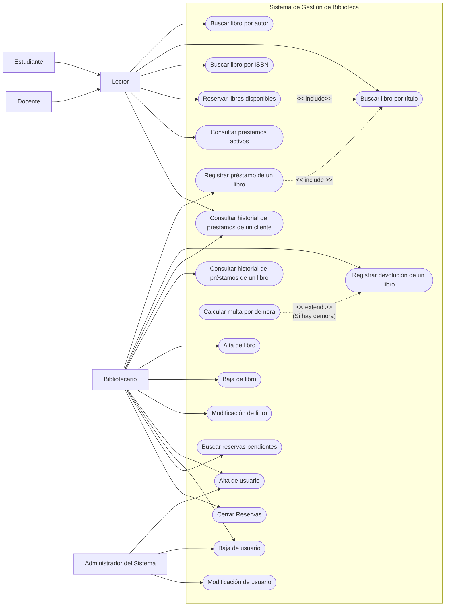

## Diagrama de Casos de Uso (Sistema de Gestión de Biblioteca)

```mermaid
graph LR

%% Actores
Lector["Lector"]
Estudiante["Estudiante"]
Docente["Docente"]
Bibliotecario["Bibliotecario"]
Admin["Administrador del Sistema"]

%% Herencia de Actores
Estudiante --> Lector
Docente --> Lector

%% Sistema
subgraph Sistema ["Sistema de Gestión de Biblioteca"]
    
    %% Búsquedas
    UC_BuscarAutor(["Buscar libro por autor"])
    UC_BuscarTitulo(["Buscar libro por título"])
    UC_BuscarISBN(["Buscar libro por ISBN"])
    
    %% Reservas y Consultas Lector
    UC_Reservar(["Reservar libros disponibles"])
    UC_ConsultarActivos(["Consultar préstamos activos"])

    %% Gestión de Reservas
    UC_BuscarReservasPendientes(["Buscar reservas pendientes"])
    UC_CerrarReservas(["Cerrar Reservas"])

    
    %% Historiales
    UC_HistorialCliente(["Consultar historial de préstamos de un cliente"])
    UC_HistorialLibro(["Consultar historial de préstamos de un libro"])
    
    %% Operaciones de Préstamo
    UC_Prestamo(["Registrar préstamo de un libro"])
    UC_Devolucion(["Registrar devolución de un libro"])
    UC_Multa(["Calcular multa por demora"])
    
    %% Gestión de Usuarios
    UC_AltaUsuario(["Alta de usuario"])
    UC_BajaUsuario(["Baja de usuario"])
    UC_ModifUsuario(["Modificación de usuario"])
    
    %% Gestión de Inventario
    UC_AltaLibro(["Alta de libro"])
    UC_BajaLibro(["Baja de libro"])
    UC_ModifLibro(["Modificación de libro"])

end

%% Relaciones: Lector (Estudiante y Docente heredan estas acciones)
Lector --> UC_BuscarAutor
Lector --> UC_BuscarTitulo
Lector --> UC_BuscarISBN
Lector --> UC_Reservar
Lector --> UC_ConsultarActivos
Lector --> UC_HistorialCliente

%% Relaciones: Bibliotecario
Bibliotecario --> UC_Prestamo
Bibliotecario --> UC_Devolucion
Bibliotecario --> UC_HistorialCliente
Bibliotecario --> UC_HistorialLibro
Bibliotecario --> UC_AltaLibro
Bibliotecario --> UC_BajaLibro
Bibliotecario --> UC_ModifLibro
Bibliotecario --> UC_AltaUsuario
Bibliotecario --> UC_BajaUsuario
Bibliotecario --> UC_BuscarReservasPendientes
Bibliotecario --> UC_CerrarReservas

%% Relaciones: Administrador
Admin --> UC_AltaUsuario
Admin --> UC_BajaUsuario
Admin --> UC_ModifUsuario

%% Relaciones entre Casos de Uso
UC_Multa -. "<< extend >><br>(Si hay demora)" .-> UC_Devolucion
UC_Prestamo -. "<< include >>" .-> UC_BuscarTitulo
UC_Reservar -. "<< include>>" .-> UC_BuscarTitulo
```
