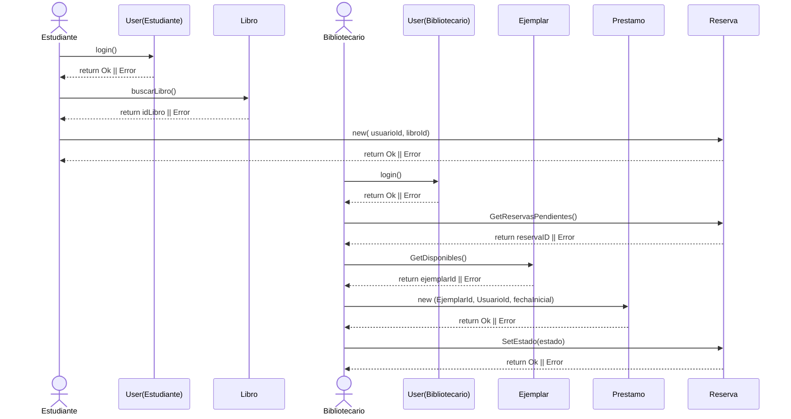

## Diagrama de Secuencia (Sistema de Gestión de Biblioteca)

```mermaid
sequenceDiagram

    actor Estudiante as Estudiante
    participant UserEst as User(Estudiante)
    participant Libro as Libro
    actor Bibliotecario as Bibliotecario
    participant UserBiblo as User(Bibliotecario)
    participant Ejemplar as Ejemplar
    participant Prestamo as Prestamo
    participant Reserva as Reserva


    Estudiante ->> UserEst: login()
    UserEst -->> Estudiante: return Ok || Error

    Estudiante ->> Libro: buscarLibro()
    Libro -->> Estudiante: return idLibro || Error

    Estudiante ->> Reserva: new( usuarioId, libroId)
    Reserva -->> Estudiante: return Ok || Error
    
    Bibliotecario ->> UserBiblo: login()
    UserBiblo -->> Bibliotecario: return Ok || Error
    

    Bibliotecario ->> Reserva: GetReservasPendientes()
    Reserva -->> Bibliotecario: return reservaID || Error

    Bibliotecario ->> Ejemplar: GetDisponibles()
    Ejemplar -->> Bibliotecario: return ejemplarId || Error

    Bibliotecario ->> Prestamo: new (EjemplarId, UsuarioId, fechaInicial)

    Prestamo -->> Bibliotecario: return Ok || Error

    Bibliotecario ->> Reserva: SetEstado(estado)
    Reserva -->> Bibliotecario: return Ok || Error


    
    %% camino de error
    
```