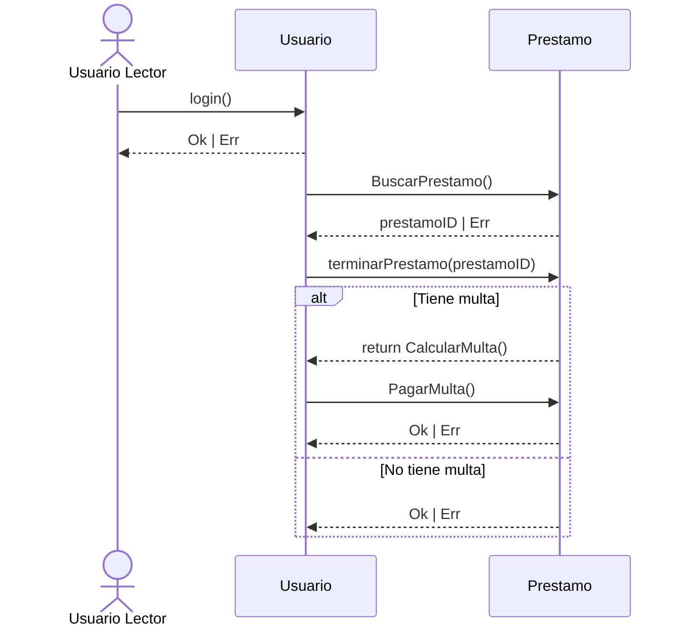

```mermaid
sequenceDiagram
    actor Usuario Lector
    participant Usuario
    participant Prestamo

    Usuario Lector->>Usuario: login()
    Usuario-->>Usuario Lector: Ok | Err

    Usuario->>Prestamo: BuscarPrestamo()
    Prestamo-->>Usuario: prestamoID | Err

    Usuario->>Prestamo: terminarPrestamo(prestamoID)
    
    alt Tiene multa
        Prestamo-->>Usuario: return CalcularMulta()

        Usuario->>Prestamo: PagarMulta()

        Prestamo-->>Usuario: Ok | Err
    else No tiene multa
        Prestamo-->>Usuario: Ok | Err
    end
```